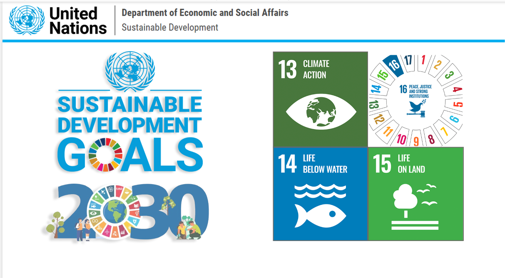
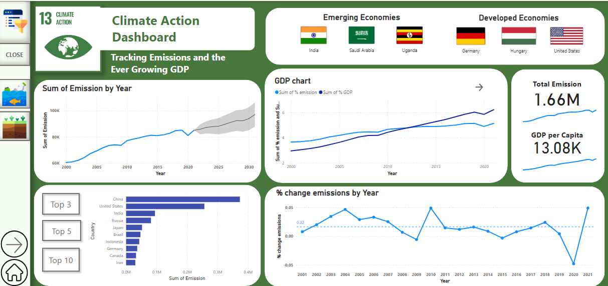
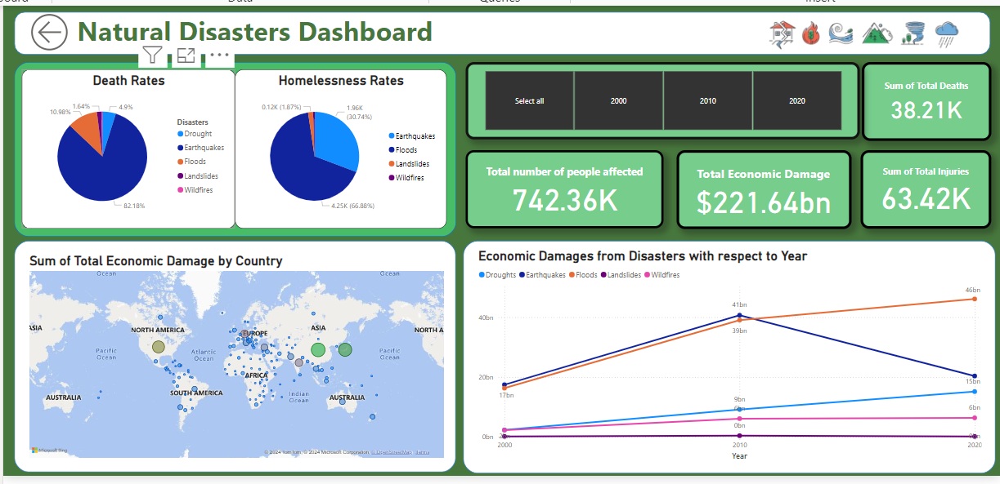
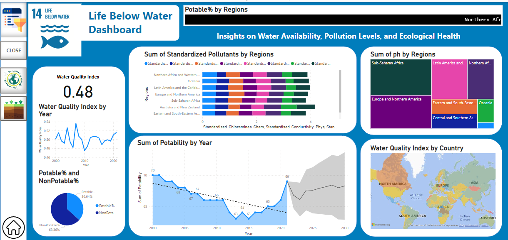
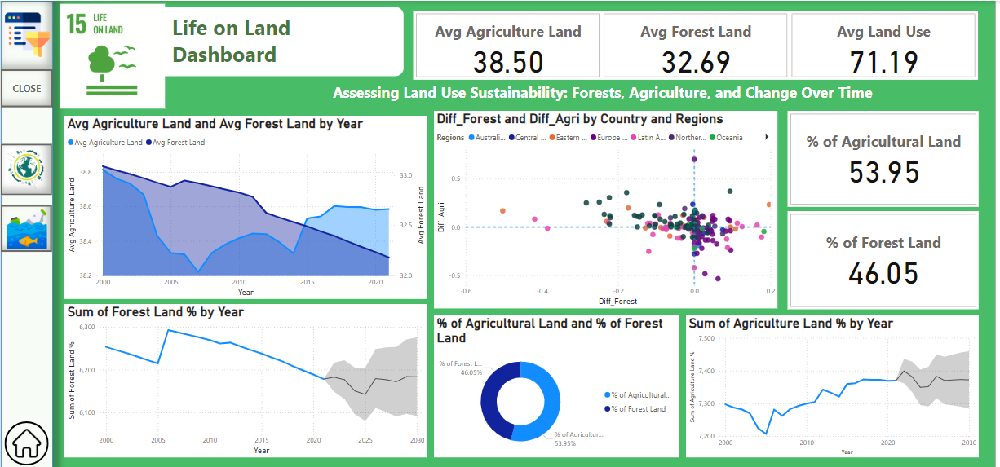

# Power BI Project: SDG Goals Prediction and Environmental Impact Analysis

This repository contains a Power BI project focused on predicting and analyzing the progress of key Sustainable Development Goals (SDGs) related to the environment. The project uses data from 2000 to recent years to track and forecast SDGs 13 (Climate Action), 14 (Life Below Water), and 15 (Life on Land).The goal of this project is to help visualize global progress towards sustainability and environmental goals while predicting future trends.

---

## Overview

This project uses Power BI to create a set of interactive dashboards to analyze the progress and predict future trends related to key environmental SDGs:

- **Goal 13: Climate Action**
- **Goal 14: Life Below Water**
- **Goal 15: Life on Land**

---

## Features

### Dashboard 1: SDG Goals 13, 14, and 15 Analysis



- **Goal 13 (Climate Action):** Focuses on monitoring the progress of global efforts to reduce carbon emissions and mitigate climate change.
- **Goal 14 (Life Below Water):** Analyzes the impact of pollution and climate change on marine ecosystems and marine biodiversity.
- **Goal 15 (Life on Land):** Tracks deforestation, land degradation, and biodiversity loss, offering a glimpse into the health of terrestrial ecosystems.

### Dashboard 2: Greenhouse Gas (GHG) Emissions


- Insights on global and regional GHG emissions data across different sectors (e.g., energy, transport, and industry).
- Predictive analysis and forecasts on future emissions trends and their alignment with international climate agreements.

### Dashboard 3: Natural Disasters Analysis


- Analysis of natural disaster trends (floods, hurricanes, wildfires, earthquakes) from 2000 to present.
- Predictive insights into how climate change may influence the frequency and intensity of natural disasters in the future.

### Dashboard 4: Water Pollution Analysis


- Data on water quality trends, pollution levels, and the main sources of water pollution (e.g., industrial waste, agricultural runoff).
- Forecasting future trends and analysis of the challenges to meeting SDG targets for clean water and sanitation.

### Dashboard 5: Land Pollution Analysis


- Insights into land pollution patterns, including waste accumulation, plastic pollution, and land contamination from industrial activities.
- Analysis and predictions on land pollution trends and the likelihood of achieving SDG targets related to land use and waste management.

---

## Installation

### Prerequisites

- Power BI Desktop (or Power BI Service)
- A modern web browser for viewing interactive reports (if using Power BI Service)

### Steps to Get Started

1. **Clone the Repository**:
   - Run the following command in your terminal:
     ```bash
     git clone git@github.com:MansiBhayade/powerbi2030.git
     ```

2. **Open Power BI Desktop**:
   - Open the `.pbix` files in Power BI Desktop to start exploring the dashboards.

3. **Load Data**:
   - Make sure you have the appropriate datasets available (can be downloaded from respective public sources), or modify the connections to pull from different data sources.

---

## How to Use

1. **Navigate through the Tabs**: Each dashboard is a separate tab within the Power BI file. You can easily switch between the SDG Goal dashboards, GHG emissions, pollution, and natural disaster analyses.
   
2. **Interact with the Visualizations**: 
   - Click on the graphs or charts to drill down into more specific data points or to filter by region or year.
   - Use slicers to adjust the view by different time periods or regions.

3. **View Predictions**: The dashboards will show both historical data and predictive analytics that forecast future trends based on past data.

4. **Key Performance Indicators (KPIs)**: The dashboards include KPI cards that highlight whether progress is on track for meeting SDG targets.

---

## Contributions

Contributions to the project are welcome! If you have ideas for new features, improvements, or fixes, feel free to fork this repository and submit a pull request. Here’s how you can contribute:

1. **Fork the repository**
2. **Create a new branch** for your feature or bug fix
3. **Make changes** and test locally
4. **Submit a pull request** with a description of your changes

---

Thank you for checking out the project! We hope it helps drive understanding and action towards achieving the SDGs goals.
